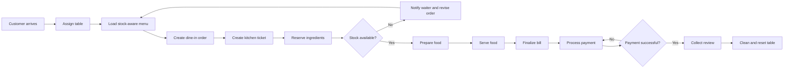
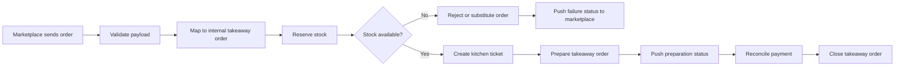
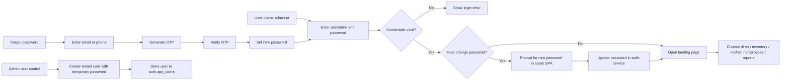

# BPMN Diagrams

This repository includes BPMN files for the two most important operational flows.

## Included Files

- [diagrams/dine-in-main-flow.bpmn](./diagrams/dine-in-main-flow.bpmn)
- [diagrams/marketplace-takeaway-flow.bpmn](./diagrams/marketplace-takeaway-flow.bpmn)

## Scope Model

The BPMN flows in this project are executed under a tenant and property scope:

- product slug: `chefy`
- route pattern: `/{productSlug}/tenant/{tenantId}/property/{propertyId}/api/...`
- database lookups: `tenant_id + property_id`
- event payloads: `tenantId + propertyId`

## Dine-In Flow Preview

## Marketplace Flow Preview

## Modeling Notes

- These BPMN files are meant to be a project starting point, not the final orchestration implementation.
- Later you can extend them with compensation, retries, timeout events, and message events for Kafka-driven execution.
- Flow execution and projections should always stay property-scoped within a tenant.

## Auth And Admin Flow Preview

This auth flow is implemented in code even though there is not yet a dedicated BPMN XML file for it.
