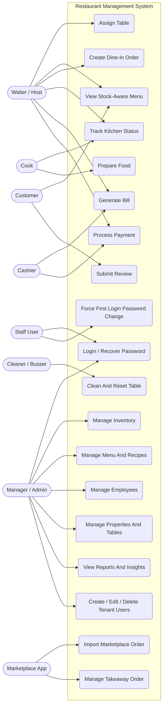

# Use Case Diagram

This diagram shows the primary actors and major system capabilities across dine-in, administration, and delivery workflows.

## Key Notes

- The dine-in core is handled by `table-service`, `catalog-service`, `inventory-service`, `order-service`, `kitchen-service`, `billing-service`, and `payment-service`.
- Reviews should stay in `review-feedback-service`, not in billing.
- Marketplace orders should enter through `marketplace-integration-service` and then move into `takeaway-service`.
- Authentication and admin user control are handled by `auth-service` and surfaced through `admin-ui`.
- There is no public sign-up page; tenant users are created by admins only.
- Operational use cases run in the `chefy -> tenant -> property` hierarchy, and runtime DB reads should be filtered by `tenant_id` and `property_id`.
