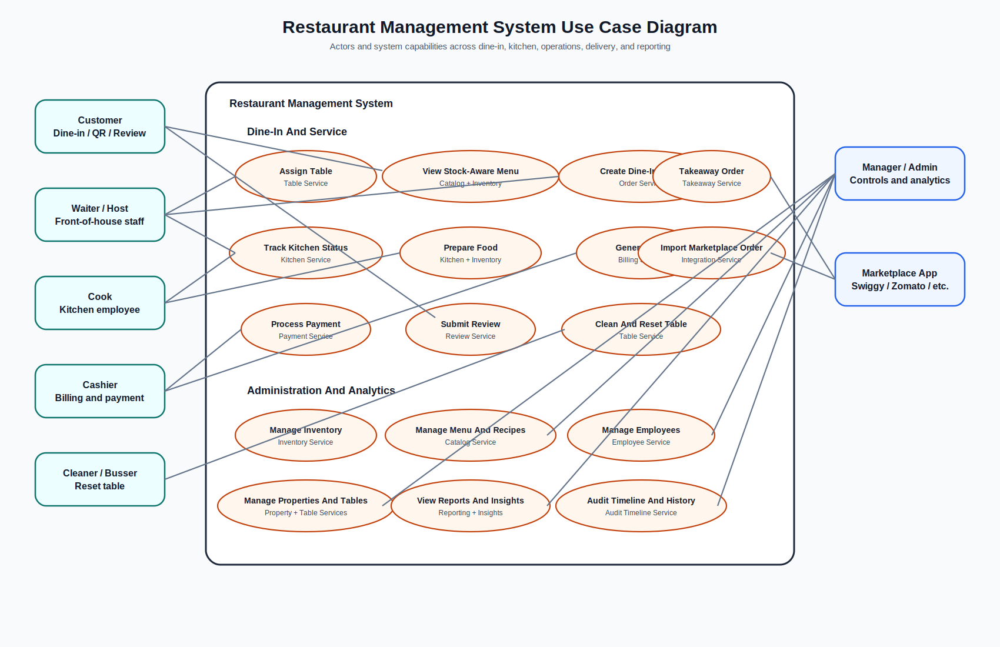
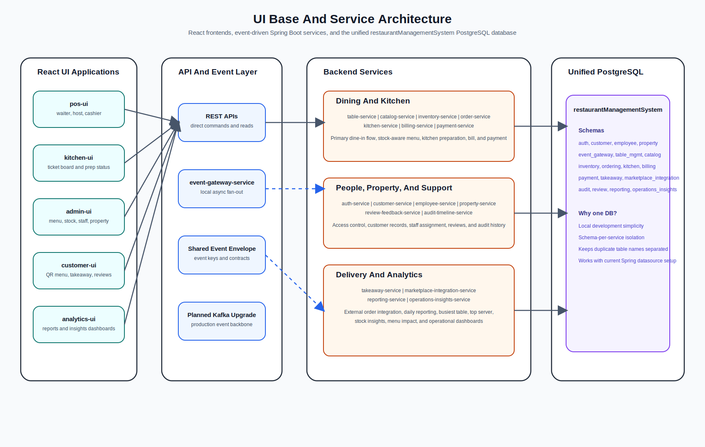

# Visual Documentation

This folder contains image-based documentation assets for the restaurant management system.

## Main Flowchart

## Use Case Diagram

## UI And Service Base

## Auth And Admin Flow

- [Auth And Admin UI](./auth-admin-flow.md)

## Notes

- These SVG files are version-controlled assets and can be opened directly from the repository.
- The flowchart focuses on the core dine-in journey.
- The use case diagram summarizes actors and system capabilities.
- The UI base image shows how the React apps, services, and unified database connect together.
- The auth/admin document explains the separate admin console and restaurant application, platform-owned sign-in, first-login password rotation, property selection, and admin-controlled employee or user access.
