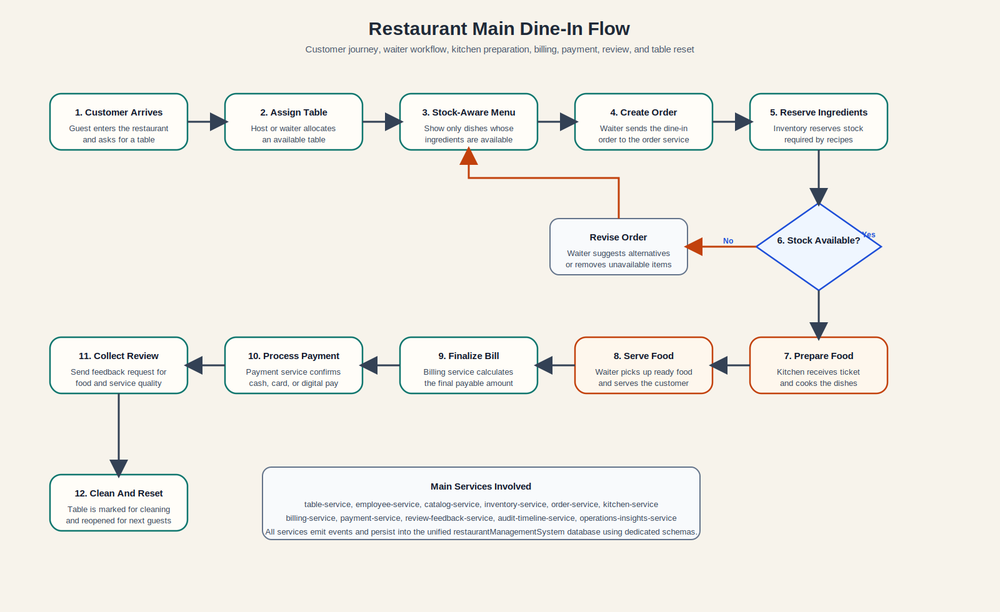

# Main Dine-In Flow

The first implementation track covers the core dine-in flow:

1. Assign table
2. Show available menu items based on recipe stock
3. Create order
4. Reserve ingredients and prepare food
5. Track kitchen status
6. Finalize bill
7. Process payment
8. Request review
9. Reset table for the next guest

The service skeletons in this repository map directly to that flow.

## Scope Rules

All operational flow calls are scoped like this:

- product slug: `chefy`
- tenant id: `bikini-bottom`
- property id: `krusty-krab` or another outlet-specific property id

Canonical operational route pattern:

- `/{productSlug}/tenant/{tenantId}/property/{propertyId}/api/{service-path}`

Example:

- `/chefy/tenant/bikini-bottom/property/krusty-krab/api/orders`

The same scope also applies to event payloads and database reads. Runtime services should fetch or project data by `tenant_id + property_id`, not by `property_id` alone.

## Current Table Flow Details

The current dine-in flow now includes the following table lifecycle rules:

- tables can be filtered by `floor` and `section` in the diner dashboard
- occupying a table requires a guest count and validates against table capacity
- the server selector only shows waiters assigned to the selected floor-section
- `RESERVED` tables capture reservation party size and reservation time
- a reservation warning appears when the booking is within `30 minutes`, and the operator can explicitly override it
- after payment, the table is scheduled to transition to `NEEDS_CLEANING` after `120 seconds`
- cleaners assigned to the floor-section can be selected to return the table to `AVAILABLE`
- the standard cleaner cycle returns the table after `300 seconds`, while the operator can still complete the step immediately
- `UNAVAILABLE` is controlled from property settings and blocks seating in the diner dashboard

